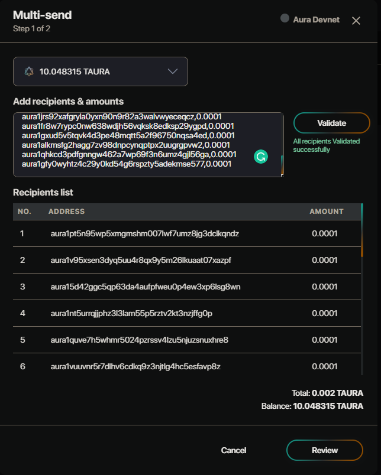

# For Simulate Tx

Automatically estimate gas by simulate transaction. Support Pyxis Safe which has up to 20 owners. Return how much gas will pay for the transaction.

# How to use

## 1. Preparation (For Operator)

- First, you need to get all simulate address by call api `/transaction/simulate/address`

  ```
  curl -X 'GET' \
    'https://safe-api.dev.aura.network/transaction/simulate/address?internalChainId=22' \
    -H 'accept: application/json'

  {
    "ErrorCode": "SUCCESSFUL",
    "Message": "Successfully!",
    "Data": [
      "aura1pt5n95wp5xmgmshm007lwf7umz8jg3dclkqndz",
      "aura1v95xsen3dyq5uu4r8qx9y5m26lkuaat07xazpf",
      "aura15d42ggc5qp63da4aufpfweu0p4ew3xp6lsg8wn",
      "aura1nt5urrqjjphz3l3lam55p5rztv2kt3nzjffg0p",
      "aura1quve7h5whmr5024pzrssv4lzu5njuzsnuxhre8",
      "aura1vuuvnr5r7dlhv6cdkq9z3njtlg4hc5esfavp8z",
      "aura105en9s9gu96xxhxkesr0czrjxpqr9ejdn7k8p6",
      "aura1gztr692jncpnu8n8f6qxptyrlrquk6flfafjgr",
      "aura1k6jt83rpvh6cv4l8tv09up58w7k6ejxdq2gcu3",
      "aura1zlz36j28g5rlzl9dkj45xuemdjekulyd7g8cga",
      "aura135c27ecw9dtsawcg4nzv4hnadv03pnnf7v28pe",
      "aura1h704ra35256maxtr7t2e507drcwjk7nyfsfqzj",
      "aura1s204cr5j44g5epcuexdxq3r7884dyus2pgwp0y",
      "aura1ycku0ghjqzwv402a8nr42j3t4afpdl76peu8la",
      "aura1jrs92xafgryla0yxn90n9r82a3walvwyeceqcz",
      "aura1fr8w7rypc0nw638wdjh56vqksk8edksp29ygpd",
      "aura1gxud5v5tqvk4d3pe48mqtt5a2f96750nqsa4ed",
      "aura1alkmsfg2hagg7zv98dnpcynqptpx2uugrgpvw2",
      "aura1qhkcd3pdfgnngw462a7wp69f3n6umz4gjl56ga",
      "aura1gfy0wyhtz4c29y0kd54g6rspzty5adekmse577"
    ],
    "AdditionalData": []
  }
  ```

  Replace `internalChainId=22` with the internal id of the chain you want. You can get all chain info by calling API `/general/network-list`

- Send at least 1 with smallest denomination to all addresses above. You can use multi-send feature in [Pyxis-Safe](https://test.pyxis.aura.network/)

  

## 2. Call API Simulate

```
curl -X 'POST' \
  'https://safe-api.dev.aura.network/transaction/simulate' \
  -H 'accept: application/json' \
  -H 'Content-Type: application/json' \
  -d '{
  "encodedMsgs": "W3sidHlwZVVybCI6Ii9jb3Ntb3Muc3Rha2luZy52MWJldGExLk1zZ0RlbGVnYXRlIiwidmFsdWUiOnsiZGVsZWdhdG9yQWRkcmVzcyI6ImF1cmExdjk1eHNlbjNkeXE1dXU0cjhxeDl5NW0yNmxrdWFhdDA3eGF6cGYiLCJ2YWxpZGF0b3JBZGRyZXNzIjoiYXVyYXZhbG9wZXIxZWR3NGx3Y3ozZXNubGd6Y3c2MHJhOG0zOGszenlnejJ4dGwycWgiLCJhbW91bnQiOnsiYW1vdW50IjoiMSIsImRlbm9tIjoidXRhdXJhIn19fV0=",
  "safeId": "336"
}'
```

- `encodedMsgs`: The base64 encoded messages of tx you want to estimate gas. Refer code bellow as an example for encoding msg:
  ```ts
  const msgs: any = [
    {
      typeUrl: MsgTypeUrl.MultiSend,
      value: {
        inputs: [
          {
            address: safeAddress,
            coins: coins(formatBigNumber(totalAmount, true), denom),
          },
        ],
        outputs: Outputs,
      },
    },
  ];
  const encodedMsgs = Buffer.from(JSON.stringify(msgs), 'binary').toString(
    'base64',
  );
  ```
