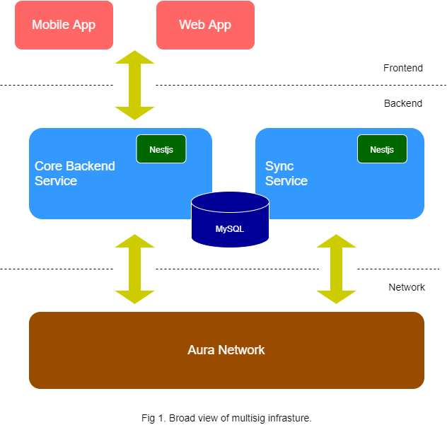

# Multisig arichitecture

Currently, our whole infrasture is constituted by mainly 1 frontend service, 2 backend service.

The core backend service received data from frontend(mobile app and web app) via API then saved in MySQL transaction information and sent transaction to Aura Network.

The sync service keep track all transaction has broadcasted by Aura Network. If this app is crashed and restarted, program would get current latest block synced in database for each address and latest block in Aura network, then use REST API (Cosmjs) to get all transaction which not synced yet.
